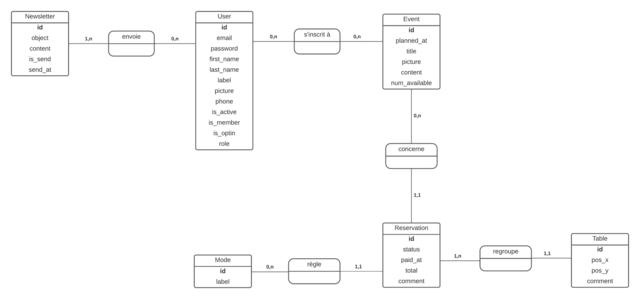
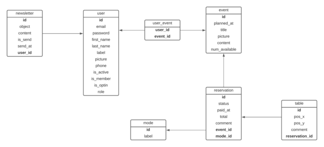

# Projet AACCP

## Le contexte du projet

Chaque année, l'AACCP (Association Alsacienne de Collectionneurs de Cartes Postales) organise un salon multicollections chaque premier dimanche de mai à Huttendorf.

Le projet se résume en un système de réservations de tables d'un exposant à l'occasion d'un salon annuel, tout en étant rattaché au nouveau site dédié à l'association.

A l'origine, les réservations et la trésorerie étaient gérés manuellement.

Il en était de même pour l'envoi de courriers, l'annonce d'un prochain salon et des nouvelles de l'association.

Un exposant peut s'inscrire avec son adresse e-mail et un mot de passe s'il le souhaite.

Il peut ensuite faire une demande de réservation.

Le cas échéant, le trésorier ou l'administrateur inscrit l'exposant manuellement avec les informations essentielles (nom, prénom et libellé).

En effet, tous les exposants n'ont pas l'accès à Internet, la maîtrise de l'outil informatique ou le souhait de fournir des informations personnelles sensibles (adresse e-mail, numéro de téléphone).

La réservation est ensuite validée selon le statut de paiement et le nombre de tables disponibles.

## L'environnement technique

**API Platform**

Il s'agit d'un framework back-end basé sur PHP et le framework Symfony, dédié à la configuration d'une API.

**MySQL**

Il s'agit d'un SGBD (système de gestion de bases de données) permettant de stocker, de manipuler et de gérer des informations dans une base de données relationnelle.

L'ORM utilisé est Sequelize.

**React**

Il s'agit d'une librairie de composants basée sur JavaScript et utilisée pour la partie front-end.

**NPM**

Il s'agit d'un gestionnaire de dépendances (ou packages) propre à NodeJS et à l'environnement de JavaScript.

**GitHub**

Il s'agit d'un gestionnaire de versions classique parmi les outils DevOPS.

**Netlify**

Il s'agit de l'hébergeur utilisé pour le déploiement de l'application front-end basée sur React.

**PHPUnit**

Il s'agit du framework de référence pour les tests automatisés en PHP.

**Jest**

Il s'agit du framework de référence pour les tests automatisés en JavaScript.

**Maildev**

Cet outil permet de tester l'envoi et la réception d'e-mails en local.

## Le traîtement des données

Le traîtement des données doit respecter la norme RGPD (Réglement Général de la Protection des Données).

Cette norme a pour but de responsabiliser les organismes traitant des données personnelles.

C'est à l'origine une directive européenne, transposée en 2018 en droit français.

Elle permet d’encadrer le traitement et la circulation des données à caractère personnel sur le territoire européen.

Ce règlement est obligatoire, et indique que les données personnelles doivent être :

- traitées de manière licite, loyale et transparente
- collectées à des fins déterminées, explicites et légitimes
- adéquates, pertinentes et limitées
- exactes et tenues à jour
- conservées pendant une durée raisonnable
- traitées de façon à garantir leur protection

Il est donc nécessaire de :

- définir une personne chargée de la protection des données (l'administrateur)
- lister les données et leur utilité
- repérer les données à risques et les protéger
- respecter le droit des membres concernant la collecte de leurs données, leur modification, leur suppression et leur oubli
- s’assurer que les sous-traitants respectent la norme RGPD

La gestion des données se déroule en 4 actions selon le modèle CRUD :

- **C**reate (créer)
- **R**ead (lire)
- **U**pdate (éditer)
- **D**elete (supprimer)

## Les rôles des utilisateurs

Les utilisateurs sont définis en 3 rôles :

- **exposant** (par défaut)
- **trésorier**
- **administrateur** (unique)

L'administrateur détient l'ensemble des droits pour la gestion des données (utilisateurs, messages, modes de paiement, documents, événements, tables, réservations).

Le trésorerier peut gérer l'ensemble des réservations et des tables.

Chaque utilisateur inscrit et connecté peut :

- consulter l'état de sa dernière réservation et ses messages
- modifier ses informations générales et ses identifiants

Un utilisateur non connecté est un invité.

## La base de données

### Les schémas

#### MCD - Modèle Conceptuel de Données

#### MCD - Modèle Logique de Données

#### MPD - Modèle Physique de Données

- newsletter (<u>id</u>, object, content, is_send, send_at, <u>#user_id</u>)
- user (<u>id</u>, email, password, first_name, last_name, label, picture, phone, is_active, is_member, is_optin, role)
- user_event (<u>#user_id, #event_id</u>)
- event (<u>id</u>, planned_at, title, picture, content, num_available)
- reservation (<u>id</u>, status, paid_at, total, comment, <u>#event_id</u>, <u>#mode_id</u>)
- mode (<u>id</u>, label)
- table (<u>id</u>, pos_x, pos_y, <u>#reservation_id</u>)

### Les entités

#### User - Les utilisateurs

|||||
|-|-|-|-|
|**id**|l'identifiant de l'utilisateur|entier|clé primaire|
|**email**|l'adresse e-mail de l'utilisateur|chaîne (255)|requis|
|**password**|le mot de passe de l'utilisateur|chaîne (255)|requis|
|**first_name**|le prénom de l'utilisateur|chaîne (50)|requis|
|**last_name**|le nom de famille de l'utilisateur|chaîne (50)|requis|
|**label**|le libellé de l'utilisateur|chaîne (255)|optionnel|
|**phone**|le numéro de téléphone de l'utilisateur|chaîne (20)|optionnel|
|**is_active**|le compte de l'utilisateur est activé|booléen|0 par défaut|
|**is_member**|l'utilisateur est un membre de l'association|booléen|0 par défaut|
|**is_optin**|l'utilisateur est inscrit à la newsletter de l'association|booléen|0 par défaut|
|**role**|le rôle de l'utilisateur ("Exposant", "Trésorier", "Administrateur")|chaîne (20)|"Exposant" par défaut|

#### Newsletter - Les newsletters

|||||
|-|-|-|-|
|**id**|l'identifiant de la newsletter|entier|clé primaire|
|**object**|le titde de la newsletter|chaîne (255)|requis|
|**content**|le contenu de la newsletter|texte|requis|
|**is_send**|la newsletter est envoyée|booléen|0 par défaut|
|**send_at**|la date d'envoi de la newsletter|date|déterminé lors de l'envoi|

#### Mode - Les modes de paiement

|||||
|-|-|-|-|
|**id**|l'identifiant du mode de paiement|entier|clé primaire|
|**label**|libellé du mode de paiement|chaîne (50)|requis|

#### Event - Les événements

|||||
|-|-|-|-|
|**id**|l'identifiant de l'événement|entier|clé primaire|
|**planned_at**|la date prévue de l'événement (JJ/MM/AAAA)|date|requis|
|**title**|l'intitulé de l'événement|chaîne (255)|requis|
|**content**|la description de l'événement|texte|requis|
|**num_available**|le nombre de tables disponibles|entier (3)|requis|
|**price**|le prix de base pour une table|décimal (2,2)|requis|

#### Reservation - Les réservations

|||||
|-|-|-|-|
|**id**|l'identifiant de la réservation|entier|clé primaire|    ,
|**number**|le nombre de table réservées|entier (2)|1 par défaut|
|**status**|le statut de paiement ("A Payer", "Payé", "Annulé")|chaîne (20)|A Payer" par défaut|
|**paid_at**|la date de paiement (JJ/MM/AAAA)|date|requis si statut "Payé"|
|**total**|la somme totale réglée pour les tables (en €)|décimal (3,2)|0 par défaut|
|**comment**|les commentaires de la réservation|texte|optionnel|

### Les cardinalités

#### User (0,n) - Newsletter (1,n)

Un utilisateur peut envoyer plusieurs newsletters. (**0,n**)

Une newsletter est envoyée à au moins un utilisateur. (**1,n**)

#### User (1,1) - Mode (0,n)

Un utilisateur utilise un seul mode de paiement. (**1,1**)

Un mode de paiement peut être adopté par plusieurs utilisateurs. (**0,n**)

#### User (0,n) - Event (0,n)

Un utilisateur peut s'inscrire à plusieurs événements. (**0,n**)

Un événement peut accueillir plusieurs exposants. (**0,n**)

#### Mode (0,n) - (1,1) Reservation

Un mode de paiement peut concerner plusieurs réservations. (**0,n**)

Une réservation est réglée avec un seul mode de paiement. (**1,1**)

#### Event (0,n) - (1,1) Reservation

Un événement peut regrouper plusieurs réservations. (**0,n**)

Une réservation concerne un seul événement. (**1,1**)

Les priorités sont définies comme suit :

|||
|-|-|
|**B**|basse|
|**M**|moyenne|
|**H**|haute|

Les états d'avancement sont définis comme suit :

|||
|-|-|
|**!**|en cours|
|**T**|à tester|
|**x**|finalisé|

***

|||
|-|-|
|**L'inscription et la connexion**||
|||
|M|L'inscription d'un utilisateur|
|M|La connexion d'un utilisateur|
|M|La déconnexion d'un utilisateur|
|H|L'inscription manuelle d'un utilisateur|
|B|La réinitialisation du mot de passe|
|B|La page de réinitialisation du mot de passe|
|||
|**Le profil d'un utilisateur**||
|||
|M|Onglet "Informations Personnelles"|
|B|Onglet "Identifiants de Connexion"|
|M|Onglet "Réservation"|
|||
|**La gestion des utilisateurs**||
|||
|H|La liste des utilisateurs|
|M|La recherche d'un utilisateur|
|H|L'inscription manuelle d'un utilisateur|
|H|L'édition manuelle d'un utilisateur|
|||
|**La gestion des événements**||
|||
|H|La liste des événements|
|B|La recherche d'un événement|
|H|L'ajout d'un événement|
|H|L'édition d'un événement|
|||
|**La gestion des modes de paiement**||
|||
|H|La liste des modes de paiement|
|H|L'ajout d'un mode de paiement|
|H|L'édition d'un mode de paiement|
|||
|**La gestion des réservations**||
|||
|H|La liste des réservations|
|M|La recherche d'une réservation|
|H|L'ajout d'une réservation|
|H|L'édition d'une réservation|
|||
|**La gestion des tables**||
|||
|H|La liste des tables|
|M|Le tri des tables|
|M|La recherche d'une table|
|H|L'ajout d'une table|
|M|L'édition d'une table|
|M|La suppression d'une table|
|||
|**La gestion des newsletters**||
|||
|B|La liste des newsletters|
|B|Le tri des newsletters|
|B|La recherche d'une newsletter|
|B|La création d'une newsletter|
|B|L'édition d'une newsletter|

## L'inscription et la connexion

### L'inscription d'un utilisateur

- **Rôle** : Invité
- **Page** : register.js

Un exposant peut s'inscrire avec :

- son **adresse e-mail**
  - format e-mail
  - requis
- son **mot de passe**
  - entre 8 et 32 caractères
  - au moins une minuscule (a-z, ç)
  - au moins une majuscule (A-Z)
  - au moins un chiffre (0-9)
  - au moins un caractère spécial (@, $)
  - requis
- son **prénom**
  - de 2 à 50 caractères alphabétiques, - inclus
  - requis
- son **nom de famille**
  - de 2 à 50 caractères alphabétiques, - inclus
  - requis
- son **numéro de téléphone**
  - de 10 à 20 caractères numériques, + inclus
  - optionnel
- son **libellé de stand**
  - de 2 à 255 caractères
  - optionnel
- son **inscription à la newsletter**
  - case à cocher (optin)
  - décoché par défaut

### La connexion d'un utilisateur

- **Rôle** : Invité
- **Page** : login.js

Un utilisateur inscrit est invité à se connecter avec :

- son adresse e-mail
- son mot de passe

Un message d'erreur s'affiche si :

- l'adresse e-mail ou le mot de passe n'est pas renseigné
- l'adresse e-mail est introuvable
- le mot de passe est incorrect

Un message confirme la connexion d'un utilisateur.

### La déconnexion d'un utilisateur

- **Rôles** : Tous (Connecté)
- **Redirection** : index.js

Un utilisateur déconnecté est redirigé vers la page d'accueil.

Un message confirme sa déconnexion.

### L'oubli de mot de passe

- **Rôle** : Invité
- **Page** : login.js

Un utilisateur peut demander la réinitialisation du mot de passe pour se connecter.

Un clic sur le lien affiche une fenêtre modale avec une adresse e-mail à renseigner.

Si l'adresse e-mail existe, l'utilisateur reçoit un e-mail de réinitialisation du mot de passe.

Sinon, un message d'erreur indique l'inexistence de l'adresse e-mail.

### La réinitialisation du mot de passe

- **Rôle** : Invité
- **Page** : reset.js

Un lien du mail de réinitialisation du mot de passe redirige l'utilisateur vers une page dédiée.

L'utilisateur doit renseigner son nouveau mot de passe et le confirmer.

Le mot de passe doit comporter :

- entre 8 et 32 caractères
- au moins une minuscule (a-z)
- au moins une majuscule (A-Z)
- au moins un chiffre (0-9)
- au moins un caractère spécial

Un message confirme la réinitialisation du mot de passe et redirige l'utilisateur sur la page de connexion.

Un message d'erreur s'affiche si le mot de passe n'est pas valide ou confirmé.

## Le profil de l'utilisateur

- **Rôles** : Tous (Connecté)
- **Page** : profile.js

### Onglet "Informations Personnelles

L'utilisateur peut changer ses informations personnelles de base :

- son **prénom**
  - de 2 et 50 caractères alphabétiques, accents et - inclus
  - requis
- son **nom de famille**
  - de 2 et 50 caractères alphabétiques, accents et - inclus
  - requis
- son **prénom**
  - de 2 et 50 caractères alphabétiques, accents et - inclus
  - requis
- son **numéro de téléphone**
  - de 10 à 20 caractères numériques, + inclus
  - optionnel
- son **libellé de stand**
  - de 2 à 255 caractères
  - optionnel
- son **inscription à la newsletter**
  - case à cocher (optin)
  - décoché par défaut

### Onglet "Identifiants de Connexion

L'utilisateur peut changer son adresse e-mail au besoin.

Il peut aussi changer son mot de passe en indiquant :

- son **ancien mot de passe**
- son **nouveau mot de passe**
- la **confirmation du nouveau mot de passe**

### Onglet "Réservation

Un utilisateur peut consulter l'état de sa réservation pour le dernier événement.

Il y retrouve :

- l'année du dernier événement
- l'intitulé du dernier événement
- le statut de paiement
- la date de paiement

## La gestion des utilisateurs

### La liste des utilisateurs

- **Rôles** : Administrateur, Trésorier
- **Page** : admin/users.js

Les utilisateurs sont listées sous forme de tableau avec :

- leur **id** (#)
- leur **prénom et nom** (**ex** : Jean DUPONT)
- leur **libellé** (**ex** : Jean Philatélie) (optionnel)
- leur **adresse e-mail** (**ex** : jean.dupont@testmail.com)
- leur **numéro de téléphone** (optionnel)
- leur **rôle** ("Exposant" en noir, "Trésorier" en vert, "Administrateur" en rouge)
- leur **statut d'activation** (case cochée ou non)
- leur **statut de membre de l'association** (case cochée ou non)
- leur **statut d'inscription à la newsletter** (case cochée ou non)
- le **bouton d'édition** des informations de l'utilisateur (crayon en vert)

L'ordre est croissant et basé sur l'ID par défaut.

### La recherche d'un utilisateur

- **Rôles** : Administrateur, Trésorier
- **Page** : admin/users.js

?

### L'inscription manuelle d'un utilisateur

- **Rôle** : Administrateur
- **Page** : admin/users-form.js

Tous les exposants n'ont pas un accès à Internet ou une maîtrise de l'outil informatique.

Certains refusent d'inscrire des informations personnelles sensibles (adresse e-mail, téléphone) sur Internet.

L'administrateur peut donc enregistrer un exposant manuellement avec :

||||
|-|-|-|
|son **prénom**|de 2 et 50 caractères alphabétiques, accents et - inclus|requis|
|son **nom de famille**|de 2 et 50 caractères alphabétiques, accents et - inclus|requis|
|son **libellé de stand**|de 2 à 255 caractères|optionnel|
|son **adresse e-mail**|format e-mail|requis ou généré aléatoirement en **@aaccp.fr**|
|son **numéro de téléphone**|de 10 à 20 caractères numériques, + inclus|optionnel|

Un bouton "Ajouter un utilisateur" (bleu avec icône "+") est visible au dessus de la liste des utilisateurs.

### L'édition manuelle d'un utilisateur

- **Rôle** : Administrateur
- **Page** : admin/users-form.js

?

## La gestion des modes de paiement

**Rôle** : Administrateur

### La liste des modes de paiement

- **Page** : admin/modes.js

?

### L'ajout des modes de paiement

- **Page** : admin/modes-form.js

?

### L'édition des modes de paiement

- **Page** : admin/modes-form.js

?

## La gestion des événements

**Rôle** : Administrateur

### La liste des événements

- **Page** : admin/events.js

?

### La recherche d'un événement

- **Page** : admin/events.js

?

### L'ajout d'un événement

- **Page** : admin/form-events.js

?

### L'édition d'un événement

- **Page** : admin/form-events.js

?

## La gestion des réservations

**Rôle** : Administrateur, Trésorier

### La liste des réservations

- **Page** : admin/reservations.js

?

### La recherche d'une réservation

- **Page** : admin/reservations.js

?

### L'ajout d'une réservation

- **Page** : admin/reservations-form.js

?

### L'édition d'une réservation

- **Page** : admin/reservations-form.js

?

## La gestion des newsletters

**Rôle** : Administrateur

### La liste des newsletters

**Page** : admin/newsletters.js

?

### La création d'une newsletter

**Page** : admin/newsletters-form.js

?

### L'édition d'une newsletter

**Page** : admin/newsletters-form.js

?

