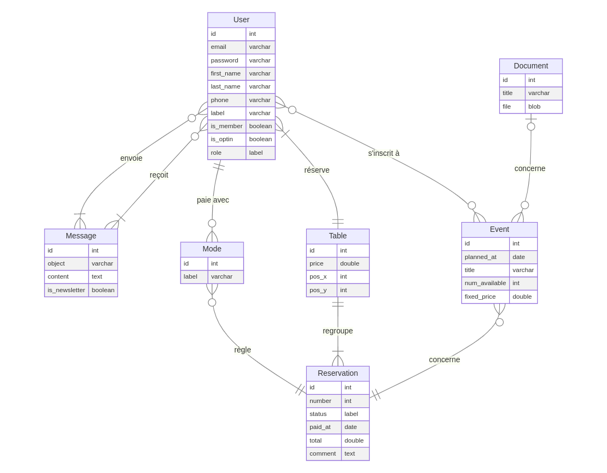

# Application AACCP - Conception

## Le contexte du projet

Chaque année, l'AACCP (Association Alsacienne de Collectionneurs de Cartes Postales) organise un salon multicollections chaque premier dimanche de mai à Huttendorf.

Le projet se résume en un système de réservations de tables d'un exposant à l'occasion d'un salon annuel, tout en étant rattaché au nouveau site dédié à l'association.

A l'origine, les réservations et la trésorerie étaient gérés manuellement.

Il en était de même pour l'envoi de courriers, l'annonce d'un prochain salon et des nouvelles de l'association.

Un exposant peut s'inscrire avec son adresse e-mail et un mot de passe s'il le souhaite.

Il peut ensuite faire une demande de réservation.

Le cas échéant, le trésorier ou l'administrateur inscrit l'exposant manuellement avec les informations essentielles (nom, prénom et libellé).

En effet, tous les exposants n'ont pas l'accès à Internet, la maîtrise de l'outil informatique ou le souhait de fournir des informations personnelles sensibles (adresse e-mail, numéro de téléphone).

La réservation est ensuite validée selon le statut de paiement et le nombre de tables disponibles.

## L'environnement technique

### Next

Il s'agit d'un framework back-end basé sur React et la JAMStack, une bibliothèque de composants logiques en JavaScript.

Il est aussi possible d'avoir un rendu côté serveur.

### Vercel

Il s'agit de l'hébergeur choisi et à l'origine du framework Next.

### GitHub

Il s'agit d'un gestionnaire de versions classique parmi les outils DevOPS.

### NPM

Il s'agit d'un gestionnaire de dépendances (ou packages) propre à NodeJS et à l'environnement de JavaScript.

### Laravel

Il s'agit d'un framework back-end basé sur le langage PHP.

### MySQL

Il s'agit d'un SGBD (système de gestion de bases de données) permettant de stocker, de manipuler et de gérer des informations dans une base de données relationnelle.

### Jest

Il s'agit du framework de référence pour les tests automatisés en JavaScript.

### Maildev

Cet outil permet de tester l'envoi et la réception d'e-mails en local.

## Les spécifications fonctionnelles

### Le traîtement des données

Le traîtement des données doit respecter la norme RGPD (Réglement Général de la Protection des Données).

Cette norme a pour but de responsabiliser les organismes traitant des données personnelles.

C'est à l'origine une directive européenne, transposée en 2018 en droit français.

Elle permet d’encadrer le traitement et la circulation des données à caractère personnel sur le territoire européen.

Ce règlement est obligatoire, et indique que les données personnelles doivent être :
- traitées de manière licite, loyale et transparente
- collectées à des fins déterminées, explicites et légitimes
- adéquates, pertinentes et limitées
- exactes et tenues à jour
- conservées pendant une durée raisonnable
- traitées de façon à garantir leur protection

Il est donc nécessaire de :

- définir une personne chargée de la protection des données (l'administrateur)
- lister les données et leur utilité
- repérer les données à risques et les protéger
- respecter le droit des membres concernant la collecte de leurs données, leur modification, leur suppression et leur oubli
- s’assurer que les sous-traitants respectent la norme RGPD

La gestion des données se déroule en 4 actions selon le modèle CRUD :
- Create (créer)
- Read (lire)
- Update (éditer)
- Delete (supprimer)

### Les utilisateurs

#### Les rôles

Les utilisateurs sont définis en 3 rôles : exposant (par défaut), trésorier et administrateur (unique).

L'administrateur détient l'ensemble des droits pour la gestion des données (utilisateurs, messages, modes de paiement, documents, événements, tables, réservations).

Le trésorerier peut gérer l'ensemble des réservations et des tables.

Chaque utilisateur inscrit et connecté peut :
- consulter l'état de sa dernière réservation et ses messages
- modifier ses informations générales et ses identifiants

Un utilisateur non connecté est un invité.

#### L'inscription d'un exposant

**Rôle** : Invité

**Page** : register.js

Un exposant peut s'inscrire avec :
- son adresse e-mail (requis)
- son mot de passe (requis, de 8 à 32 caractères, dont au moins une minuscule, une majuscule et un chiffre)
- son prénom (requis, 2 à 50 caractères alphabétiques et -)
- son nom de famille (requis, 2 à 50 caractères alphabétiques et -)
- son numéro de téléphone (optionnel, de 10 à 20 caractères numériques et +)
- son libellé de stand (optionnel, de 2 à 255 caractères)

#### La connexion d'un utilisateur

**Rôle** : Invité

**Page** : login.js

Un utilisateur inscrit est invité à se connecter avec :
- son adresse e-mail
- son mot de passe

Un message d'erreur s'affiche si :
- l'adresse e-mail est introuvable
- le mot de passe est incorrect

Un message confirme la connexion d'un utilisateur.

#### La déconnexion d'un utilisateur

**Rôles** : Exposant, Trésorier, Administrateur

Un utilisateur déconnecté est redirigé vers la page d'accueil.

Un message confirme sa déconnexion.

#### L'inscription manuelle d'un utilisateur

**Rôle** : Administrateur

**Page** : admin/users.js

Tous les exposants n'ont pas un accès à Internet ou une maîtrise de l'outil informatique.

Certains refusent d'inscrire des informations personnelles sensibles (adresse e-mail, téléphone) sur Internet.

L'administrateur peut donc enregistrer un exposant manuellement avec :
- son prénom (requis, 2 à 50 caractères alphabétiques et -)
- son nom de famille (requis, 2 à 50 caractères alphabétiques et -)
- son numéro de téléphone (optionnel, de 10 à 20 caractères numériques et +)
- son libellé de stand (optionnel, de 2 à 255 caractères)

**Exposant**

- inscription manuelle d'un utilisateur
- réinitialisation du mot de passe
- envoi d'un nouveau mot de passe
- consultation d'une réservation
- édition du profil

**Trésorier**

- liste des utilisateurs
- recherche d'un utilisateur

**Administrateur**

- ajout d'un utilisateur
- édition des informations d'un utilisateur
- suppression d'un utilisateur

### Les événements

**Rôle** : Administrateur

- liste des événements
- recherche d'un événement
- ajout d'un événement
- édition d'un événement
- suppression d'un événement

### Les réservations

**Rôles** : Administrateur, Trésorier

- liste des réservations
- recherche d'une réservation
- ajout d'une réservation
- édition d'une réservation
- suppression d'une réservation

(...)

## La base de données

## Les entités

### User - Les utilisateurs

|||||
|-|-|-|-|
|**id**|l'identifiant de l'utilisateur|entier|clé primaire|
|**email**|l'adresse e-mail de l'exposant / utilisateur|chaîne (255)|optionnel pour un exposant|
|**password**|le mot de passe de l'exposant / utilisateur|chaîne (255)|optionnel pour un exposant|
|**first_name**|le prénom de l'exposant / utilisateur|chaîne (50)|requis|
|**last_name**|le nom de famille de l'exposant / utilisateur|chaîne (50)|requis|
|**phone**|le numéro de téléphone de l'exposant|chaîne (20)|optionnel|
|**label**|le libellé de l'exposant|chaîne (255)|optionnel|
|**is_member**|l'exposant est un membre de l'association|booléen|"non" par défaut|
|**is_optin**|l'exposant est inscrit à la newsletter de l'association|booléen|"non" par défaut|
|**role**|le rôle de l'utilisateur ("Exposant", "Trésorier", "Administrateur")|chaîne (20)|"Exposant" par défaut|

### Message - Les messages

|||||
|-|-|-|-|
|**id**|l'identifiant du message|entier|clé primaire|
|**object**|objet du message|chaîne (255)|requis|
|**content**|contenu textuel du message|texte|requis|
|**is_newsletter**|envoi groupé ou newsletter|booléen|"non" par défaut|

### Mode - Les modes de paiement

|||||
|-|-|-|-|
|**id**|l'identifiant du mode de paiement|entier|clé primaire|
|**label**|libellé du mode de paiement|chaîne (50)|requis|

### Document - Les documents

|||||
|-|-|-|-|
|**id**|l'identifiant du document|entier|clé primaire|
|**title**|l'intitulé du document|chaîne (255)|requis|
|**file**|le fichier source (document texte, image)|blob|requis|

### Event - Les événements

|||||
|-|-|-|-|
|**id**|l'identifiant de l'événement|entier|clé primaire|
|**planned_at**|la date prévue de l'événement (JJ/MM/AAAA)|date|requis|
|**title**|l'intitulé de l'événement|chaîne (255)|requis|
|**num_available**|le nombre de tables disponibles|entier (3)|requis|
|**fixed_price**|le prix de base pour une table|décimal (2,2)|requis|

### Table - Les tables

|||||
|-|-|-|-|
|**id**|l'identifiant de la table|entier|clé primaire|
|**price**|prix individuel d'une table|décimal (2,2)|déterminé par le prix de base **fixed_price** par défaut|
|**pos_x**|emplacement X (horizontal) de la table sur le plan de la salle|entier|optionnel|
|**pos_y**|emplacement Y (vertical) de la table sur le plan de la salle|entier|optionnel|

### Reservation - Les réservations

|||||
|-|-|-|-|
|**id**|l'identifiant de la réservation|entier|clé primaire|
|**number**|le nombre de table réservées|entier (2)|1 par défaut|
|**status**|le statut de paiement ("A Payer", "Payé", "Annulé")|chaîne (20)|"A Payer" par défaut|
|**paid_at**|la date de paiement (JJ/MM/AAAA)|requis si statut "Payé"|
|**total**|la somme totale réglée pour les tables (en €)|décimal (3,2)|0 par défaut|
|**comment**|les commentaires de la réservation|texte|optionnel|
|**mode_id**|l'identifiant du mode de paiement|entier|clé étrangère|
|**event_id**|l'identifiant de l'événement|entier|clé étrangère|

## Les cardinalités

### User (0,n) - Message (1,n)

Un utilisateur peut envoyer plusieurs messages à un autre utilisateur. (0,n)

(réflexion, en même temps)

### User (1,1) - Mode (0,n)

Un utilisateur utilise un seul mode de paiement. (1,1)

Un mode de paiement peut être adopté par plusieurs utilisateurs. (0,n)

## La modélisation (UML)

### Les cas d'utilisation

### Diagrammes de classe

### MCD (Modèle Conceptuel de Données)

### MLD (Modèle Logique de Données)

### Schéma relationnel

