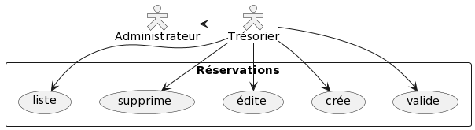
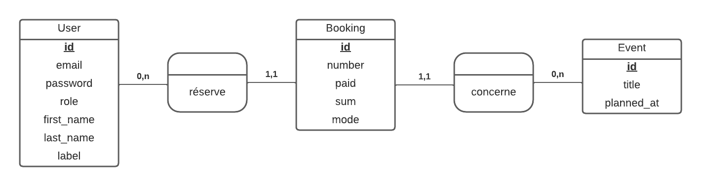
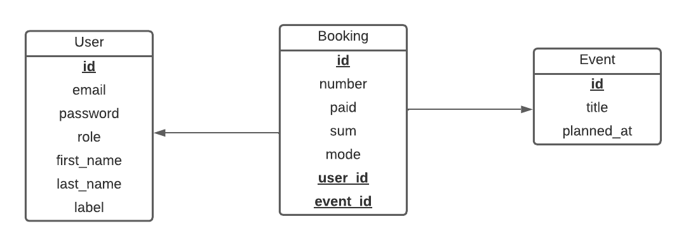
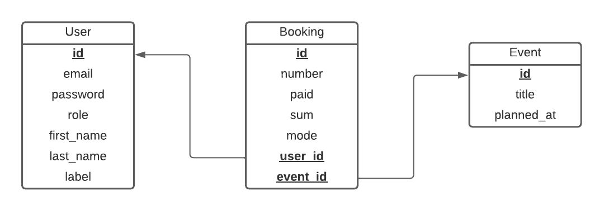

# Réalisation

## La base de données

(schéma)

## Les entités

### User - Les utilisateurs

|||||
|-|-|-|-|
|**id**|l'identifiant de l'utilisateur|entier|clé primaire|
|**email**|l'adresse e-mail de l'exposant / utilisateur|chaîne (255)|optionnel pour un exposant|
|**password**|le mot de passe de l'exposant / utilisateur|chaîne (255)|optionnel pour un exposant|
|**first_name**|le prénom de l'exposant / utilisateur|chaîne (50)|requis|
|**last_name**|le nom de famille de l'exposant / utilisateur|chaîne (50)|requis|
|**phone**|le numéro de téléphone de l'exposant|chaîne (20)|optionnel|
|**label**|le libellé de l'exposant|chaîne (255)|optionnel|
|**is_member**|l'exposant est un membre de l'association|booléen|"non" par défaut|
|**is_optin**|l'exposant est inscrit à la newsletter de l'association|booléen|"non" par défaut|
|**role**|le rôle de l'utilisateur ("Exposant", "Trésorier", "Administrateur")|chaîne (20)|"Exposant" par défaut|

### Message - Les messages

|||||
|-|-|-|-|
|**id**|l'identifiant du message|entier|clé primaire|
|**object**|objet du message|chaîne (255)|requis|
|**content**|contenu textuel du message|texte|requis|
|**is_newsletter**|envoi groupé ou newsletter|booléen|"non" par défaut|

### Mode - Les modes de paiement

|||||
|-|-|-|-|
|**id**|l'identifiant du mode de paiement|entier|clé primaire|
|**label**|libellé du mode de paiement|chaîne (50)|requis|

### Document - Les documents

|||||
|-|-|-|-|
|**id**|l'identifiant du document|entier|clé primaire|
|**title**|l'intitulé du document|chaîne (255)|requis|
|**file**|le fichier source (document texte, image)|blob|requis|

### Event - Les événements

|||||
|-|-|-|-|
|**id**|l'identifiant de l'événement|entier|clé primaire|
|**planned_at**|la date prévue de l'événement, au format JJ/MM/AAAA|date|requis|
|**title**|l'intitulé de l'événement|chaîne (255)|requis|
|**num_available**|le nombre de tables disponibles|entier (3)|requis|
|**fixed_price**|le prix de base pour une table|décimal (2,2)|requis|

### Table - Les tables

|||||
|-|-|-|-|
|**id**|l'identifiant de la table|entier|clé primaire|
|**price**|prix individuel d'une table|décimal (2,2)|déterminé par le prix de base **fixed_price** par défaut|
|**pos_x**|emplacement X (abscisses) de la table sur le plan de la salle|entier|optionnel|
|**pos_y**|emplacement Y (ordonnées) de la table sur le plan de la salle|entier|optionnel|

### Reservation - Les réservations

|||||
|-|-|-|-|
|**id**|l'identifiant de la réservation|entier|clé primaire|
|**number**|le nombre de table réservées|entier (2)|0 par défaut|
|**paid**|le statut de paiement ("oui" / "non")|booléen|"non" par défaut|
|**paid_at**|la date de paiement (JJ/MM/AAAA)|date courante par défaut|
|**sum**|la somme réglée (en €)|décimal (3,2)|0 par défaut|
|**mode**|le mode de paiement ("Chèque", "Espèces")|chaîne (10)|"Espèces" par défaut|
|**user_id**|l'identifiant de l'exposant concerné|entier|clé étrangère|

## La modélisation (UML)

### Les cas d'utilisation

### Diagrammes de classe

### MCD (Modèle Conceptuel de Données)

### MLD (Modèle Logique de Données)

### Schéma relationnel

