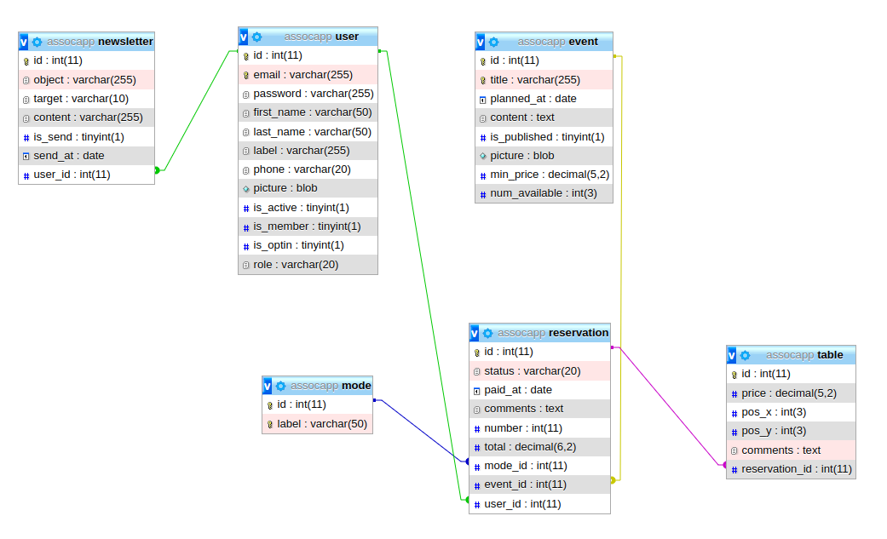

[Retour au sommaire](README.md)

***

# La base de données

## Les schémas

### MCD -  Modèle Conceptuel de Données

### MLD -  Modèle Logique de Données

### MPD -  Modèle Physique de Données

- newsletter (**id**, object, target, content, is_send, send_at)
- newsletter_user (**#newsletter_id, #user_id**)
- user (**id**, email, password, first_name, last_name, label, picture, phone, is_active, is_member, is_optin, role)
- event (**id**, title, planned_at, picture, content, is_published, min_price, num_available)
- reservation (**id**, status, paid_at, comments, number, total, **#event_id**, **#user_id**, **#mode_id**)
- mode (**id**, label)
- table (**id**, price, pos_x, pos_y, comments, **#reservation_id**)

### Modèle relationnel (PHPMyAdmin)

## Les entités

### Newsletter - Les newsletters

nom|description|type|règle
-|-|-|-
**id**|l'identifiant de la newsletter|entier|clé primaire
**object**|le titre de la newsletter|chaîne (255)|requis
**target**|la cible de la newsletter ("Général" ou "Membres")|chaîne (10)|"Général" par défaut
**content**|le contenu de la newsletter|texte|requis
**is_send**|la newsletter est envoyée|booléen|0 par défaut
**send_at**|la date d'envoi de la newsletter|date|déterminé lors de l'envoi

### User - Les utilisateurs

nom|description|type|règle
-|-|-|-
**id**|l'identifiant de l'utilisateur|entier|clé primaire
**email**|l'adresse e-mail de l'utilisateur|chaîne (255)|requis, unique
**password**|le mot de passe de l'utilisateur|chaîne (255)|requis
**first_name**|le prénom de l'utilisateur|chaîne (50)|requis
**last_name**|le nom de famille de l'utilisateur|chaîne (50)|requis
**label**|le libellé de l'utilisateur|chaîne (255)|optionnel
**picture**|la photo ou l'avatar de l'utilisateur|blob|optionnel
**phone**|le numéro de téléphone de l'utilisateur|chaîne (20)|optionnel
**is_active**|le compte de l'utilisateur est activé|booléen|0 par défaut
**is_member**|l'utilisateur est un membre de l'association|booléen|0 par défaut
**is_optin**|l'utilisateur est inscrit à la newsletter de l'association|booléen|0 par défaut
**role**|le rôle de l'utilisateur ("Exposant", "Trésorier", "Administrateur")|chaîne (20)|"Exposant" par défaut

### Event - Les événements

nom|description|type|règle
-|-|-|-
**id**|l'identifiant de l'événement|entier|clé primaire
**title**|l'intitulé de l'événement|chaîne (255)|requis, unique
**planned_at**|la date prévue de l'événement (JJ/MM/AAAA)|date|requis
**picture**|l'image d'illustration de l'événement|blob|optionnel
**content**|la description de l'événement|texte|requis
**is_published**|l'événement est annoncé sur le site|booléen|0 par défaut
**min_price**|le prix de base par table (en €)|décimal (5,2)|0 par défaut
**num_available**|le nombre de tables disponibles|entier (3)|0 par défaut

### Reservation - Les réservations

nom|description|type|règle
-|-|-|-
**id**|l'identifiant de la réservation|entier|clé primaire
**status**|le statut de paiement ("A Payer", "Payé", "Annulé")|chaîne (20)|"A Payer" par défaut
**paid_at**|la date de paiement (JJ/MM/AAAA)|date|date du jour par défaut
**comments**|les commentaires de la réservation|texte|optionnel
**number**|le nombre de tables de la réservation (de 1 à 12)|entier(2)|calculé lors de la définition des tables
**total**|la somme totale réglée de la réservation (en €)|décimal (6,2)|calculé lors de la définition des tables

### Mode - Les modes de paiement

nom|description|type|règle
-|-|-|-
**id**|l'identifiant du mode de paiement|entier|clé primaire
**label**|le libellé du mode de paiement|chaîne (50)|requis

### Table - Les tables

nom|description|type|règle
-|-|-|-
**id**|l'identifiant de la table|entier|clé primaire
**price**|le prix individuel d'une table|décimal (5,2)|prix de base pour un événement par défaut
**pos_x**|la position en abscisses (X) de la table|entier (3)|0 par défaut
**pos_y**|la position en ordonnées (Y) de la table|entier (3)|0 par défaut
**comments**|les commentaires d'une table|texte|optionnel

## Les cardinalités

### User (0,n) - Newsletter (1,n)

Un utilisateur peut envoyer plusieurs newsletters. (**0,n**)

Une newsletter est envoyée à au moins un utilisateur. (**1,n**)

### User (0,n) - Reservation (1,1)

Un utilisateur peut faire plusieurs réservations. (**0,n**)

Une réservation concerne un seul utilisateur. (**1,1**)

### Mode (0,n) - (1,1) Reservation

Un mode de paiement peut concerner plusieurs réservations. (**0,n**)

Une réservation est réglée avec un seul mode de paiement. (**1,1**)

### Event (0,n) - (1,1) Reservation

Un événement peut regrouper plusieurs réservations. (**0,n**)

Une réservation concerne un seul événement. (**1,1**)

### Table (1,1) - (1,n) Reservation

Une table est liée à une seule réservation. (**1,1**)

Une réservation regroupe au moins une table. (**1,n**)
