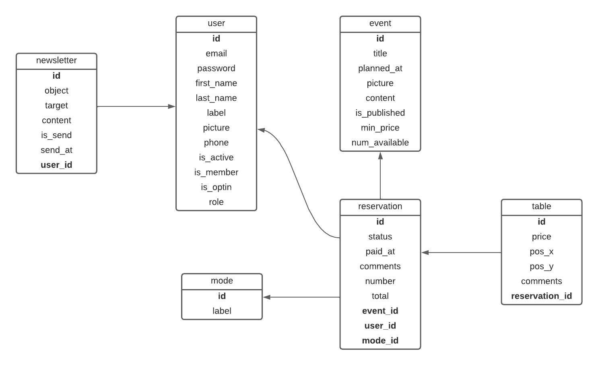

# La base de données

## Les schémas

### MCD -  Modèle Conceptuel de Données

### MCD -  Modèle Logique de Données

### MPD -  Modèle Physique de Données

- **newsletter** (<u>id</u>, object, content, is_send, send_at, <u>#user_id</u>)
- **user** (<u>id</u>, email, password, first_name, last_name, label, picture, phone, is_active, is_member, is_optin, role)
- **user_event** (<u>#user_id, #event_id</u>)
- **event** (<u>id</u>, planned_at, title, picture, content, num_available)
- **reservation** (<u>id</u>, status, paid_at, total, comment, <u>#event_id</u>, <u>#mode_id</u>)
- **mode** (<u>id</u>, label)
- **table** (<u>id</u>, pos_x, pos_y, comment, <u>#reservation_id</u>)

## Les entités

### User - Les utilisateurs

nom|description|type|règle
-|-|-|-
**id**|l'identifiant de l'utilisateur|entier|clé primaire
**email**|l'adresse e-mail de l'utilisateur|chaîne (255)|requis
**password**|le mot de passe de l'utilisateur|chaîne (255)|requis
**first_name**|le prénom de l'utilisateur|chaîne (50)|requis
**last_name**|le nom de famille de l'utilisateur|chaîne (50)|requis
**label**|le libellé de l'utilisateur|chaîne (255)|optionnel
**phone**|le numéro de téléphone de l'utilisateur|chaîne (20)|optionnel
**is_active**|le compte de l'utilisateur est activé|booléen|0 par défaut
**is_member**|l'utilisateur est un membre de l'association|booléen|0 par défaut
**is_optin**|l'utilisateur est inscrit à la newsletter de l'association|booléen|0 par défaut
**role**|le rôle de l'utilisateur ("Exposant", "Trésorier", "Administrateur")|chaîne (20)|"Exposant" par défaut

### Newsletter - Les newsletters

nom|description|type|règle
-|-|-|-
**id**|l'identifiant de la newsletter|entier|clé primaire
**object**|le titre de la newsletter|chaîne (255)|requis
**content**|le contenu de la newsletter|texte|requis
**is_send**|la newsletter est envoyée|booléen|0 par défaut
**send_at**|la date d'envoi de la newsletter|date|déterminé lors de l'envoi

### Mode - Les modes de paiement

nom|description|type|règle
-|-|-|-
**id**|l'identifiant du mode de paiement|entier|clé primaire
**label**|libellé du mode de paiement|chaîne (50)|requis

### Event - Les événements

nom|description|type|règle
-|-|-|-
**id**|l'identifiant de l'événement|entier|clé primaire
**planned_at**|la date prévue de l'événement (JJ/MM/AAAA)|date|requis
**title**|l'intitulé de l'événement|chaîne (255)|requis
**picture**|l'image d'illustration de l'événement|blob|optionnel
**content**|la description de l'événement|texte|requis
**num_available**|le nombre de tables disponibles|entier (3)|requis

### Reservation - Les réservations

nom|description|type|règle
-|-|-|-
**id**|l'identifiant de la réservation|entier|clé primaire
**status**|le statut de paiement ("A Payer", "Payé", "Annulé")|chaîne (20)|"A Payer" par défaut
**paid_at**|la date de paiement (JJ/MM/AAAA)|date|requis si statut "Payé"
**total**|la somme totale réglée pour les tables (en €)|décimal (3,2)|0 par défaut
**comment**|les commentaires de la réservation|texte|optionnel

### Table - Les tables

nom|description|type|règle
-|-|-|-
**id**|l'identifiant de la table|entier|clé primaire
**pos_x**|la position en abscisses (X) de la table|entier (3)|0 par défaut
**pos_y**|la position en ordonnées (Y) de la table|entier (3)|0 par défaut
**comment**|les commentaires d'une table (ex : "situé près de la porte de sortie")|texte|optionnel

## Les cardinalités

### User (0,n) - Newsletter (1,n)

Un utilisateur peut envoyer plusieurs newsletters. (**0,n**)

Une newsletter est envoyée à au moins un utilisateur. (**1,n**)

### User (0,n) - Event (0,n)

Un utilisateur peut s'inscrire à plusieurs événements. (**0,n**)

Un événement peut accueillir plusieurs exposants. (**0,n**)

### Mode (0,n) - (1,1) Reservation

Un mode de paiement peut concerner plusieurs réservations. (**0,n**)

Une réservation est réglée avec un seul mode de paiement. (**1,1**)

### Event (0,n) - (1,1) Reservation

Un événement peut regrouper plusieurs réservations. (**0,n**)

Une réservation concerne un seul événement. (**1,1**)

### Table (1,1) - (1,n) Reservation

Une table est liée à une seule réservation. (**1,1**)

Une réservation regroupe au moins une table. (**1,n**)
